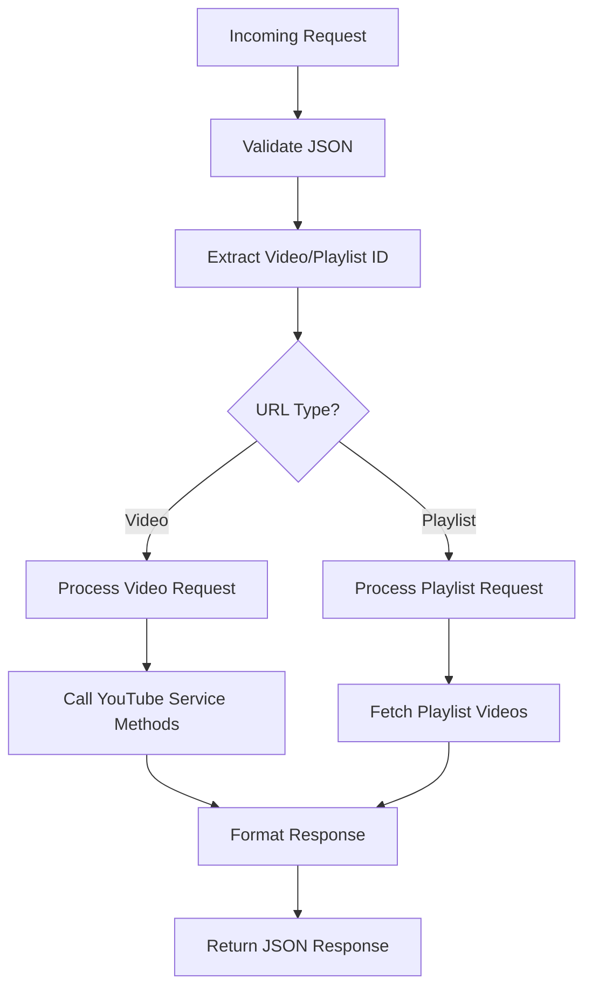

# Design Document

## Overview

This design enhances Fabric's existing YouTube REST API by adding new endpoints for metadata, comments, playlist processing, and comprehensive content extraction. The design maintains backward compatibility with the existing `/youtube/transcript` endpoint while adding robust error handling, CORS support, and structured response formats.

## Architecture

### Current State Analysis
- Existing endpoint: `POST /youtube/transcript`
- Current handler: `YouTubeHandler` in `internal/server/youtube.go`
- Backend service: `youtube.YouTube` in `internal/tools/youtube/`
- Available methods: `GrabTranscript`, `GrabTranscriptWithTimestamps`, `GrabComments`, `GrabMetadata`

### Enhanced Architecture
The design extends the existing `YouTubeHandler` with additional endpoints while leveraging the existing YouTube service infrastructure. All new endpoints will follow RESTful conventions and return consistent JSON responses.

## Components and Interfaces

### 1. Enhanced YouTubeHandler

```go
type YouTubeHandler struct {
    yt *youtube.YouTube
}

// New request/response types
type MetadataRequest struct {
    URL string `json:"url" binding:"required"`
}

type CommentsRequest struct {
    URL        string `json:"url" binding:"required"`
    MaxResults int    `json:"maxResults,omitempty"` // Default: 100, Max: 100
}

type ExtractRequest struct {
    URL               string `json:"url" binding:"required"`
    Language          string `json:"language,omitempty"`
    IncludeTranscript bool   `json:"includeTranscript,omitempty"`
    IncludeComments   bool   `json:"includeComments,omitempty"`
    IncludeMetadata   bool   `json:"includeMetadata,omitempty"`
    Timestamps        bool   `json:"timestamps,omitempty"`
    MaxComments       int    `json:"maxComments,omitempty"`
}

type PlaylistRequest struct {
    URL                string `json:"url" binding:"required"`
    IncludeTranscripts bool   `json:"includeTranscripts,omitempty"`
    Offset             int    `json:"offset,omitempty"`
    Limit              int    `json:"limit,omitempty"` // Default: 50, Max: 100
}
```

### 2. Response Structures

```go
type MetadataResponse struct {
    VideoID     string    `json:"videoId"`
    Title       string    `json:"title"`
    Description string    `json:"description"`
    Duration    int       `json:"duration"` // seconds
    ViewCount   int64     `json:"viewCount"`
    PublishDate time.Time `json:"publishDate"`
    ChannelName string    `json:"channelName"`
    ChannelID   string    `json:"channelId"`
}

type CommentsResponse struct {
    VideoID  string    `json:"videoId"`
    Comments []Comment `json:"comments"`
    Total    int       `json:"total"`
}

type Comment struct {
    Author      string    `json:"author"`
    Text        string    `json:"text"`
    PublishDate time.Time `json:"publishDate"`
    LikeCount   int       `json:"likeCount"`
}

type ExtractResponse struct {
    VideoID    string            `json:"videoId"`
    Transcript *string           `json:"transcript,omitempty"`
    Comments   []Comment         `json:"comments,omitempty"`
    Metadata   *MetadataResponse `json:"metadata,omitempty"`
    Errors     []string          `json:"errors,omitempty"`
}

type PlaylistResponse struct {
    PlaylistID string              `json:"playlistId"`
    Videos     []PlaylistVideoInfo `json:"videos"`
    Total      int                 `json:"total"`
    Offset     int                 `json:"offset"`
    Limit      int                 `json:"limit"`
}

type PlaylistVideoInfo struct {
    VideoID    string  `json:"videoId"`
    Title      string  `json:"title"`
    Duration   int     `json:"duration"`
    Transcript *string `json:"transcript,omitempty"`
}
```

### 3. New Endpoints

| Method | Endpoint | Description |
|--------|----------|-------------|
| POST | `/youtube/metadata` | Extract video metadata |
| POST | `/youtube/comments` | Extract video comments |
| POST | `/youtube/extract` | Extract multiple content types |
| POST | `/youtube/playlist` | Process playlist videos |
| OPTIONS | `/youtube/*` | CORS preflight support |

### 4. Error Response Structure

```go
type ErrorResponse struct {
    Error   string            `json:"error"`
    Code    string            `json:"code"`
    Details map[string]string `json:"details,omitempty"`
}
```

## Data Models

### Enhanced YouTube Service Integration

The design leverages existing methods in `youtube.YouTube`:
- `GrabMetadata(videoId string) (*VideoMetadata, error)`
- `GrabComments(videoId string) ([]string, error)`
- `FetchPlaylistVideos(playlistID string) ([]*VideoMeta, error)`
- `GetVideoOrPlaylistId(url string) (videoId, playlistId string, err error)`

### URL Processing Flow



## Error Handling

### Error Categories

1. **Validation Errors (400)**
   - Invalid JSON format
   - Missing required fields
   - Invalid URL format
   - Parameter out of range

2. **Authentication Errors (503)**
   - YouTube API key not configured
   - API key invalid or expired

3. **Resource Errors (404/403)**
   - Video not found
   - Video private/unavailable
   - Playlist private/unavailable

4. **Service Errors (503)**
   - YouTube API unavailable
   - yt-dlp not installed
   - Network connectivity issues

5. **Rate Limiting (429)**
   - YouTube API quota exceeded
   - Too many requests

### Error Response Examples

```json
{
  "error": "YouTube API key not configured",
  "code": "YOUTUBE_API_KEY_MISSING",
  "details": {
    "setup_command": "fabric --setup",
    "documentation": "https://github.com/danielmiessler/fabric#setup"
  }
}
```

## Testing Strategy

### Unit Tests
- Request validation logic
- URL parsing and ID extraction
- Response formatting
- Error handling scenarios

### Integration Tests
- End-to-end API endpoint testing
- YouTube service integration
- Error response validation
- CORS header verification

### Mock Testing
- YouTube API unavailable scenarios
- Network timeout handling
- Invalid API key responses

## CORS Configuration

```go
func (h *YouTubeHandler) setupCORS(c *gin.Context) {
    c.Header("Access-Control-Allow-Origin", "*")
    c.Header("Access-Control-Allow-Methods", "POST, OPTIONS")
    c.Header("Access-Control-Allow-Headers", "Content-Type, Authorization")
    c.Header("Access-Control-Max-Age", "86400")
}
```

## Performance Considerations

### Caching Strategy
- Implement response caching for metadata (TTL: 1 hour)
- Cache playlist information (TTL: 30 minutes)
- No caching for transcripts and comments (dynamic content)

### Rate Limiting
- Implement per-IP rate limiting (100 requests/hour)
- Separate limits for different endpoint types
- Graceful degradation when limits exceeded

### Async Processing
- For playlist processing with many videos
- Background transcript extraction for large playlists
- Progress tracking for long-running operations

## Security Considerations

### Input Validation
- Strict URL format validation
- Parameter range checking
- JSON schema validation
- SQL injection prevention (though not applicable here)

### API Key Protection
- Never expose YouTube API key in responses
- Secure environment variable storage
- Key rotation support

### Resource Protection
- Request size limits
- Timeout configurations
- Memory usage monitoring